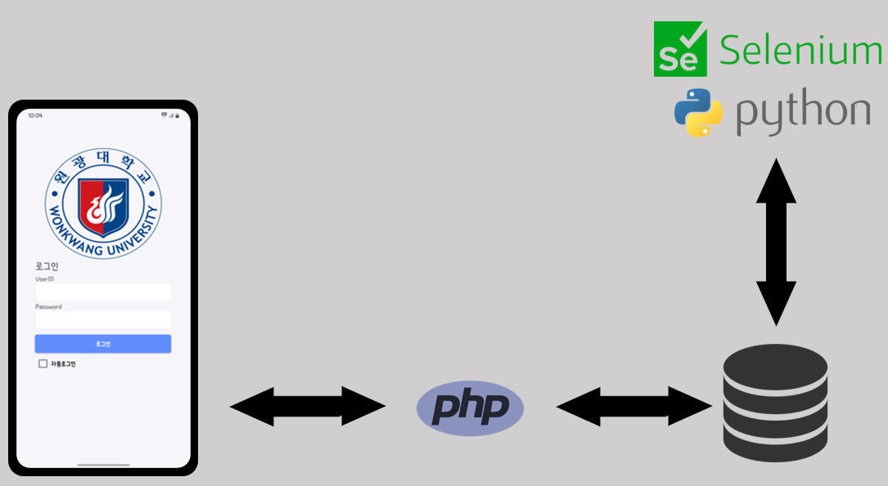
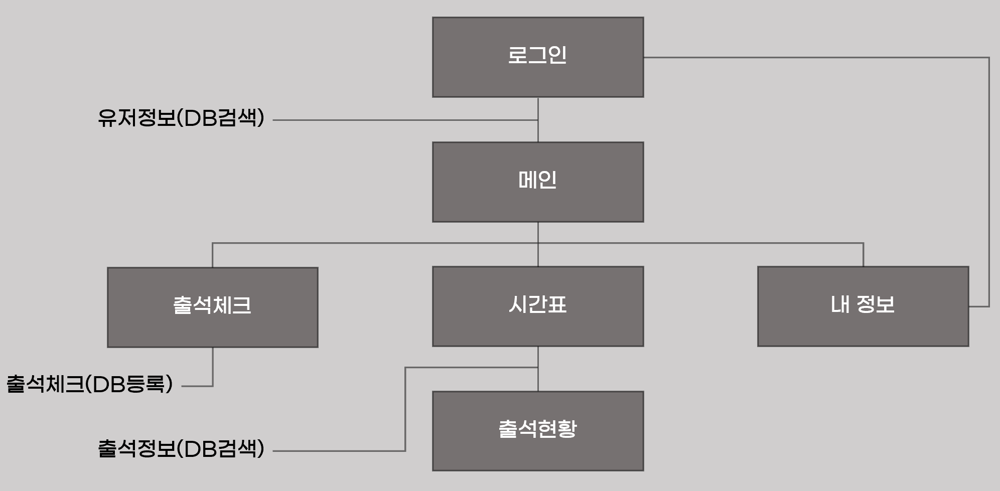
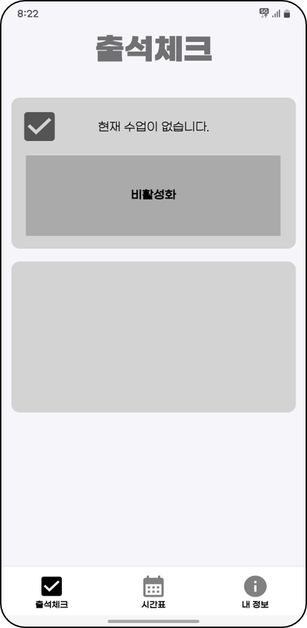
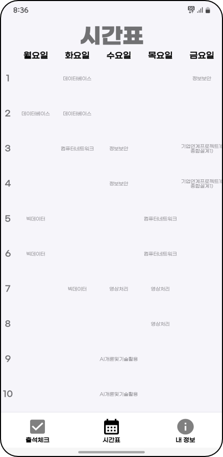
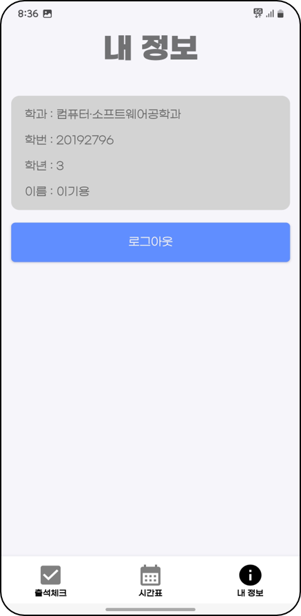
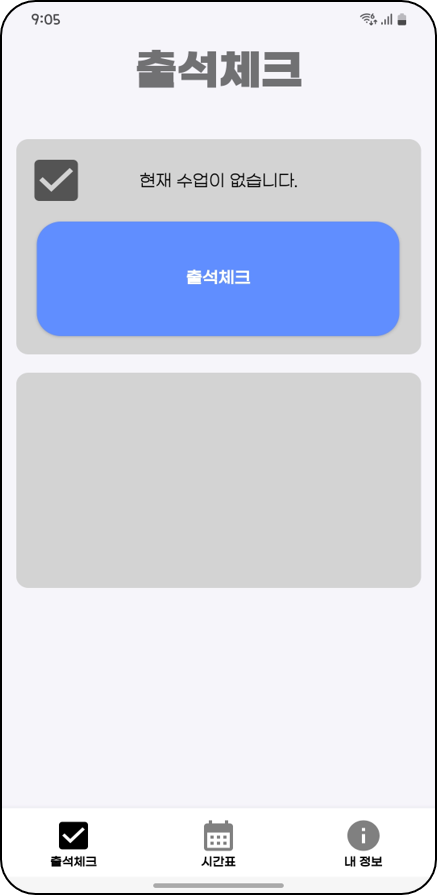

# 📌 원광대학교 기업연계 프로젝트
## 📱 프로젝트명: 출석체크 애플리케이션

## 📅 개발 기간
2023년 2학기

## 📋 프로젝트 설명
기존의 수업 출석 방식은 교수님의 호명으로 인해 시간이 소요되는 단점이 있었습니다.  
이를 개선하기 위해, 학생들이 애플리케이션을 통해 직접 출석할 수 있도록 지원하는 시스템을 개발하였습니다.  
본 프로젝트는 출석 과정을 간소화하여 수업의 효율성을 높이는 것을 목표로 합니다.

## 🧭 앱 사용 흐름
1. **애플리케이션 실행**  
   사용자 기기에서 출석체크 앱을 실행합니다.

2. **비콘(Beacon) 실행**  
   교수 측에서 비콘을 활성화하여 출석 환경을 설정합니다.

3. **출석체크 버튼 활성화** 
   사용자의 기기가 비콘 신호를 감지하면, 출석체크 버튼이 활성화됩니다.

4. **출석체크 버튼 클릭**  
   사용자는 활성화된 버튼을 눌러 출석을 등록합니다.

5. **출석체크 완료**  
   출석 정보가 서버에 전송되며, 성공 메시지 또는 확인 화면이 표시됩니다.

## 📚 기술 스택
- **Frontend**: Android (Java)
- **Backend**: php, python, MySQL
- **Cloud**: Cafe24
- **ETC**: arduino

## 📝 시스템 구성도

## 🗂 IA (Information Architecture)

## 📸 앱 스크린샷

| 메인 화면 | 시간표 | 내 정보 페이지 |
|:---------:|:------:|:-------------:|
|  |  |  |

| 비콘 활성화 전 | 비콘 활성화 후 |
|:--------------:|:--------------:|
|  |  |

